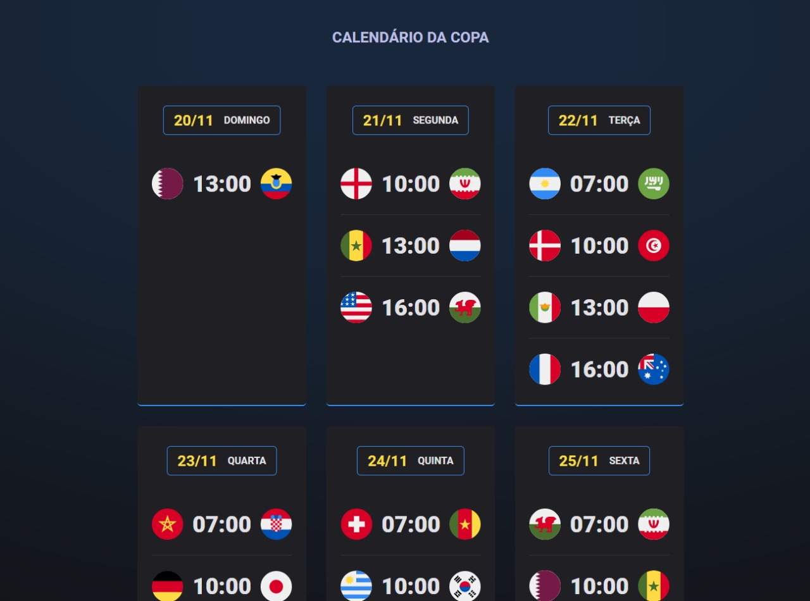

<h1 align="center"> World Cup Games </h1>

A simple development of the table of the world cup group stage games.

  <a href="#-tecnologias">Technologies</a>&nbsp;&nbsp;&nbsp;|&nbsp;&nbsp;&nbsp;
  <a href="#-projeto">Project</a>&nbsp;&nbsp;&nbsp;|&nbsp;&nbsp;&nbsp;
  <a href="#-layout">Site</a>&nbsp;&nbsp;&nbsp;|&nbsp;&nbsp;&nbsp;
  <a href="#memo-licença">License</a>

  

 

  

## 💻 Technologies

This project was developed with the following technologies:

- HTML and CSS
- JavaScript
- Figma
- Git and Github

## 💻 Project

With this website you can see all the group stage games, divided by days.
If you want to improve the project, tell me!

## 🌐 Site

You can check the project with this link: https://jogos-da-copa-qatar-2022.vercel.app

## :memo: License

This project is under the MIT license.

---

Check my others projects!👋
